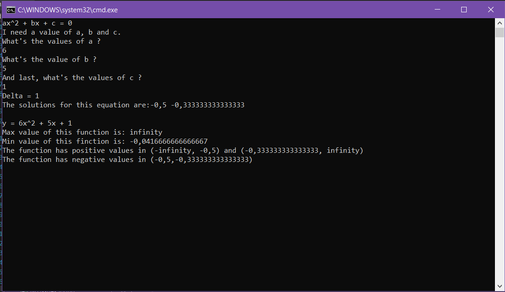

# Quadratic-Equation-Analysis
A simple piece of code, created to analize a quadratic function and to find solutions to a quadtratic equation, with it's parameters.
## Table of Contents
* [General Info](#general-information)
* [Features](#features)
* [Screenshots](#screenshots)
* [Setup](#setup)
* [Project Status and Future Plans](#project-status-and-future-plans)
* [Feedback](#feedback)

## General Information
- The project was created to have an easier and faster way of solving algebra problems, by quickly analyzing a quadratic function.
- Based on the parameters a, b and c of a function put in the programme, it calculates the delta and then finds
zero points, a vertex (min/max point) and positive and negative values of a quadratic equation parabola.
- It's a farily simple piece of code, made in C# with VS. 
-Created and uploaded for educational purposes.

## Features
What does it do?
- Calculates the delta of an equation, the zero points x1 and x2 and the minimum and maximum point of the function.
- Points out the areas in which the function has positive and negative values, regarding the values of the delta and tha "a" parameter.

## Screenshots

## Setup
Simply download the files and run them with a coding program.

## Project Status and Future Plans
This project is _in finished_ , however I might go back and redo it.

Going back on this project I came across an idea of remaking it into a from app, with an interactive interface and pictures of the solutions

## Feedback
Feel free to leave feedback!
